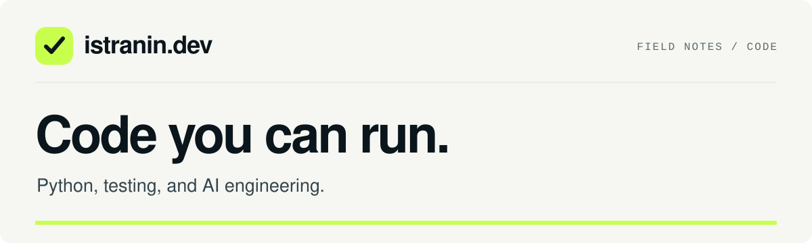

[](https://istranin.dev/)

# istranin.dev code examples

Runnable code examples for Python testing, pytest, FastAPI, and AI engineering articles on
[istranin.dev](https://istranin.dev/).

[](https://github.com/artem-istranin/istranin-dev-code-examples/actions/workflows/test-examples.yml)

**[Browse examples](#article-examples) · [Getting started](#getting-started) · [Articles](https://istranin.dev/) · [Courses](https://istranin.dev/courses/)**

Each directory is a self-contained project with its own dependencies, `pyproject.toml`, and `uv.lock`.
Read the corresponding article for the explanation, then use its example to run and explore the code.

## Article examples

| Example | Topics | Article |
| --- | --- | --- |
| [Pytest fixtures and mocking for AI agents](pytest-llm-fixtures/) | Scripted models, OpenAI and Anthropic adapters, HTTP mocks, offline CI | [Read ↗](https://istranin.dev/blog/pytest-fixtures-mocking-llm-agents/) |
| [Your first pytest test](pytest-for-beginners-first-python-test/) | Given-When-Then, plain assertions, failure reports, boundaries | [Read ↗](https://istranin.dev/blog/pytest-for-beginners-first-python-test/) |
| [Python unit testing best practices](python-unit-testing-best-practices-pytest/) | Behavior, parametrization, explicit fixtures, autospecced collaborators | [Read ↗](https://istranin.dev/blog/python-unit-testing-best-practices-pytest/) |
| [GitHub Actions Python testing](github-actions-python-testing-pytest/) | Python matrix, coverage, JUnit reports, stable merge check | [Read ↗](https://istranin.dev/blog/github-actions-python-testing-pytest/) |
| [FastAPI testing with pytest](fastapi-testing-pytest/) | API testing, `TestClient`, validation, boundary cases | [Read ↗](https://istranin.dev/blog/fastapi-testing-pytest/) |
| [Behavior-driven development in Python with pytest-bdd](behavior-driven-development-python-pytest-bdd/) | Shared examples, Gherkin, scenario outlines, reservation outcomes, TDD integration | [Read ↗](https://istranin.dev/blog/behavior-driven-development-python-pytest-bdd/) |
| [LangGraph agent testing with pytest](langgraph-agent-testing/) | Agent graphs, tool calls, pytest-mock, failure paths | [Read ↗](https://istranin.dev/blog/test-langgraph-agent-pytest/) |
| [Pytest hooks examples](pytest-hooks-examples/) | Select checkout tests by environment and print commands to rerun failures | [Read ↗](https://istranin.dev/blog/pytest-hooks-examples/) |
| [Pytest mocking tutorial](pytest-mocking-tutorial/) | `mocker`, class and method patches, mock drift, lookup targets, decorators | [Read ↗](https://istranin.dev/blog/pytest-mocking-tutorial/) |
| [Pytest fixtures and parametrization](pytest-fixtures-parametrization/) | Fixture architecture, factories, indirect setup, dynamic cases, scope costs, parallel workers | [Read ↗](https://istranin.dev/blog/pytest-fixtures-parametrization-scalable-tests/) |
| [Test-driven development in Python with pytest](test-driven-development-python-pytest/) | Red-green-refactor, exceptions, parametrization, state boundaries | [Read ↗](https://istranin.dev/blog/test-driven-development-python-pytest/) |
| [Unit testing vs integration testing vs E2E in Python](unit-integration-e2e-testing-python/) | Test boundaries, real configuration, subprocess CLI tests, regression and acceptance | [Read ↗](https://istranin.dev/blog/unit-integration-e2e-testing-python/) |

Open an example directory and follow its README to install the locked dependencies and run the code.

## Getting started

You need Python 3.13 or newer and [uv](https://docs.astral.sh/uv/getting-started/installation/).
Clone the repository and choose an example. For instance, to run the FastAPI tests:

```bash
git clone https://github.com/artem-istranin/istranin-dev-code-examples.git
cd istranin-dev-code-examples/fastapi-testing-pytest
uv sync --locked
uv run pytest test_main.py -v
```

Run commands inside the example directory. Each example keeps its own environment and locked
dependencies; the repository root is a catalog. The example README includes its expected results
and any additional commands or exercises.

## Adding an example

Keep each example focused on its companion article and independently runnable. Follow the same
README structure used throughout this repository:

1. The istranin.dev wordmark, example title, and a direct link to the companion article.
2. **Overview** — the example's purpose and scope.
3. **Requirements** — Python, uv, and any example-specific prerequisites.
4. **Run the example** — commands and expected results.
5. **Project files** — a map of the relevant source, tests, and dependency files.
6. Any article-specific walkthroughs, experiments, or sources, followed by the shared navigation footer.

Preserve each article's teaching content, include its `pyproject.toml` and `uv.lock`, and add the
example and article links to the catalog above.

## Author and license

Created by [Artem Istranin](https://istranin.dev/). Find the full articles and practical courses on
[istranin.dev](https://istranin.dev/).

This repository is licensed under the [Apache License 2.0](LICENSE).
